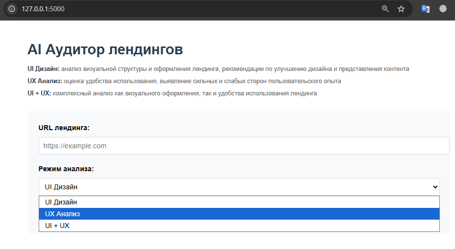
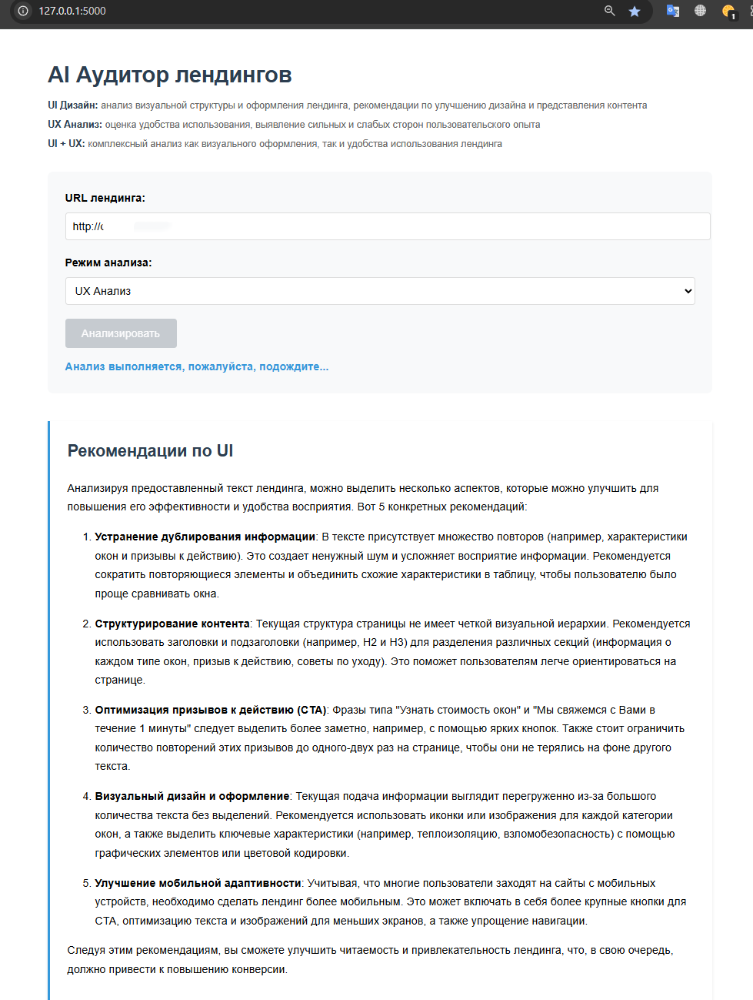

# 🚀 AI Аудитор Лендингов

Интеллектуальный веб-сервис для комплексного UI/UX анализа лендингов с помощью LLM (OpenAI). Генерирует рекомендации по улучшению дизайна, структуры и пользовательского опыта на основе содержимого сайта.

---

## ⚡️ Возможности
- **UI-анализ:** Оценка визуального оформления, структуры блоков и стиля лендинга.
- **UX-анализ:** Выявление сильных и слабых сторон пользовательского опыта, предложения по улучшению.
- **Комбинированный режим:** Получение обоих типов отчётов одновременно.
- **Веб-интерфейс:** Запуск и использование через браузер.

---

## 🗂️ Структура проекта

```
project_root/
├── main.py               # Flask-приложение, запуск сервера
├── agent.py              # Логика агента/LLM
├── openai_module.py      # Работа с OpenAI API
├── parser.py             # Парсер сайтов
├── requirements.txt      # Зависимости
├── README.md             # Документация
├── templates/
│   └── index.html        # HTML-шаблон интерфейса
└── ...                   # Прочие файлы
```

---

## 🛠️ Установка и запуск
1. Установите зависимости:
   ```bash
   pip install -r requirements.txt
   ```
2. Создайте файл переменных окружения и добавьте свой OpenAI API ключ:
   ```bash
   cp .env.example .env
   # Откройте .env и укажите OPENAI_API_KEY
   ```
3. Запустите веб-приложение:
   ```bash
   python main.py
   ```
4. Откройте в браузере: [http://localhost:5000](http://localhost:5000)

---

## 💻 Пример работы
```
AI Аудитор лендингов
--------------------
URL: https://example.com
Режим: UI + UX

Рекомендации по UI:
• Увеличить контраст текста в хедере
• Добавить отступы между блоками
• ...

UX Анализ:
Плюсы:
• Четкая структура
• Быстрая загрузка
• ...

Минусы:
• Отсутствует поиск
• Сложная навигация
• ...

Рекомендации:
• Добавить поиск по сайту
• Упростить меню
• ...
```

## 🖼️ Интерфейс приложения

### 1. Главная страница — ввод URL и выбор режима



---

### 2. Пример вывода результата анализа



📦 Стек технологий
Python 3.10+
Flask, Jinja2
OpenAI API (GPT-4o)
BeautifulSoup4
requests, tenacity, python-dotenv
📄 Лицензия
MIT